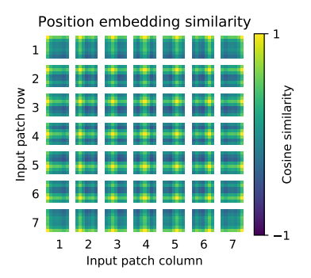
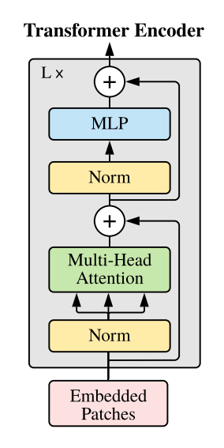

# Replicating Vision Transformers (ViT)

## 1. Introduction

The introduction of the transformer architecture by [**Vaswani et. al.**](https://doi.org/10.48550/arXiv.1706.) had the most significant impact on the field of artificial intelligence over the last decade. The architecture was so robust that only minimal changes have been proposed since 2017, with the most notable modification being the rearrangement of the layer normalization block. Having a pair of encoder-decoder while completely relying on attention to learn the patterns in the given sequence has proven to be effective enough to introduce the architecture for almost every use case in deep learning.

This project will focus on replicating the model proposed by [**Dosovitskiy et. al.**](https://doi.org/10.48550/arXiv.2010.11929), known as the Vision-Transformer (ViT). This paper introduces the transformer architecture (part of it) to the field of computer vision and image classification tasks. We will disect the parts of the ViT and implement it using PyTorch step-by-step.

**Note: All the hyperparameter numbers described in the examples below are directly extracted from the research paper. The numbers relate to the simplest ViT model.**

- [Replicating Vision Transformers (ViT)](#replicating-vision-transformers-vit)
  - [1. Introduction](#1-introduction)
  - [2. Input to Encoder](#2-input-to-encoder)
    - [2.1. Creating Patches](#21-creating-patches)
    - [2.2. Patch Embeddings](#22-patch-embeddings)
      - [2.2.1. Hybrid architecture](#221-hybrid-architecture)
    - [2.3. Prepend Class Embedding](#23-prepend-class-embedding)
    - [2.4. Adding Positional Embeddings](#24-adding-positional-embeddings)
      - [2.4.1. Why use positional embeddings?](#241-why-use-positional-embeddings)
  - [3. Transformer Encoder](#3-transformer-encoder)
    - [3.1. Layer Normalizations](#31-layer-normalizations)
    - [3.2. Residual Connections](#32-residual-connections)
    - [3.3. Multi-Head Self-Attention](#33-multi-head-self-attention)
    - [3.4. Multi-layer Perceptron](#34-multi-layer-perceptron)
  - [4. Classifier](#4-classifier)

## 2. Input to Encoder

We start by processing the image data which is fed to the transformer encoder. We will look at the encoder in a later part of this project. First, we will focus on converting our image data into the below shown format before feeding it to the transformer encoder.

**Overview** (just to read through, detailed explanation is below):
- Each image is chopped into multiple pieces (patches).
- Data that is in these patches is converted to patch embeddings.
- An extra learnable embedding is added (prepended) to the patch embeddings. This represents the class of our image (same as \<classification> token in BERT).
- Learnable embedding is the layer which will contain the useful information when we use the model for inference. The learnt information from the encoder will be stored here.
- Adding positional embeddings to give positional information regarding our data. 

  
   
  <em>Looking at the input of the transformer encoder</em>

---

### 2.1. Creating Patches

- Chop the image into `n` number of patches. This will be `num_patches`.

- The height and width of each patch will be `p`. This will be `patch_size`.

- Example:
    - An image of size `224 x 224` with `3` color channels will be of size `(3, 224, 224)`.

    - Each patch is of size `(16, 16)`. So, `patch_size = (16, 16)`. The number of chops along the height is `224 / 16 = 14`, and similarly, along the width, it is also `224 / 16 = 14`.

    - Having 14 pieces along height and 14 pieces along width makes the `num_patches = 14 * 14 = 196`.

    - We have `196` pieces of data for our encoder. Each patch of the image is treated sperately while feeding it to the encoder. 

---

### 2.2. Patch Embeddings

- We have `num_patches` number of patches. Each patch is a piece of an image.

- These patches will have the size of a fixed size. This will be flattened and embedded into `d` number of dimensions. This will be `embed_dims`.

- Each patch is treated serperately. The dependencies and patterns across all the patches is learnt by the multi-head self attention layer in the encoder block (will be discussed later). 

- Example:
    - Each patch is of the size `16 x 16`.

    - This data will be projected (embedded) into `embed_dims` number of dimensions. Let us take `embed_dims = 768`.

    - Each patch will be turned to a linear vector which has the size of `768`. Total number of patches will be `196`.

    - The output will be of size `(768, 196)` which will be reshaped for better readability.

    - After reshaping it will be of size `(196, 768)` which shows that there are `196` patches of data with each patch having `768` dimensions.

#### 2.2.1. Hybrid architecture

> As an alternative to raw image patches, the input sequence can be formed from feature maps of a CNN (LeCun et al., 1989). In this hybrid model, the patch embedding projection `E` (Eq. 1) is applied to patches extracted from a CNN feature map.

The above given text is from [**Dosovitskiy et. al.**](https://doi.org/10.48550/arXiv.2010.11929). It suggests that rather than flattening and embedding the patches, we can also apply an alternative approach. This is introducing CNN to extract feature maps from these images and then flattening these feature maps which will represent the linearly embedded data for each patch. This will be the approach for this project.

**CNN for embedding**:
- Using CNN with `kernel_size` of `16 x 16` which is the same as `patch_size`.

- Using `stride` value of `16 x 16` which is the same as `patch_size`.

- Using these two values will convert an image of size `(3, 224, 224)` into `(d, 14, 14)` as each patch will be converted to one single value from our CNN. Here, `d` is the `output_channels` of our CNN layer. This will be `embed_dims = 768` as it represents the number of dimensions that each patch has to be embedded into.

- The two dimensions of `14` will be flattened to have `196` patches of data. 

---

### 2.3. Prepend Class Embedding

- After the computations of patch embeddings, a learnable dimension has to be prepended to the `patch_embeddings`.

- Learnable: The model will use this layer to learn the classes of our data. 

- Usually initialized with `randn` from the `torch` library. This will be a `nn.Parameter` object. 

- Using `nn.Parameter` will track gradients making the values modifiable through gradient descent which will be done during training.

- We will be using this layer as the input to our classifer block. (discussed in detail later)

- Example: 
    - The ouput of `patch_embeddings` will have the shape of `(196, 768)` for the number of patches and the dimension of each patch respectively.

    - A learnable classification embedding will be prepended to the `196` patches of data. The learnable layer will have the same dimensions as `embed_dims`. 

    - We will be using `torch.randn` to get random and normalized tensor which will be used in `nn.Paramter`.

    - We will be using `nn.Parameter` and setting `requires_grad = True` to make the values modifiable with gradient descent.

    - This will have the shape of `(1, 768)` which will be prepended to the patch embeddings.

    - The output after prepending will have the shape of `(197, 768)`

--- 

### 2.4. Adding Positional Embeddings

- After the computations of all the required embeddings, the focus is to provide some information regarding the positions of the patches with respect to the whole image.

- This information regarding its positions will also be a learnable parameter. The model will learn the positional information during training. The explanation for this is given below.

- The process is same as the `class_embedding`.

- Example: 
    - We have the output from the `class_embedding` section which has the shape of `(197, 768)`.

    - Similar process of using `torch.randn` with `nn.Parameter` while setting `requires_grad = True`. This will be of shape `(197, 768)`

    - An element wise addition will be done using `positional_embeddings`. This addition provides the gateway to gradient descent.

    - Image shown below shows the plot of a learned positional embedding.

#### 2.4.1. Why use positional embeddings?

  
   
  <em>Learned positional embedding with `num_patches = 49`</em>

- This is to have some information regarding the postiions of our patches within the whole image. Imagining cutting an image into thousands of pieces and asking your friend to use these pieces to understand the whole image.

> The position embeddings at initialization time carry no information about the 2D positions of the patches and all spatial relations between the patches have to be learned from scratch.

- The paper does not use positional encodings from [**Vaswani et. al.**](https://doi.org/10.48550/arXiv.1706.) as the static values of the encoding process shows less improvements during the training for image data.

- The model sees better results with the positional embeddings where it is learnable and modifiable by the model during training.

- The problem arises while fine-tuning the model as the general consensus is to fine-tune a model on higher resolution data. Higher resolution images with the same `patch_size` will lead to higher number of patches. This makes the learnt positional embeddings during training to be useless. The solution is to perform interpolation of the pre-trained positional embeddings while respecting its position in images.

--- 

## 3. Transformer Encoder

All the data has been processed and is ready to be passed on to the transformer encoder. This section focuses on the architecture of the transformer encoder. The encoder will have multiple layers such as normalization layers, multi-head self-attention layers and multi-layer perceptrons. These layers will be used to learn the information within the patches and store it in the learnable embedding layer.

**Overview**:
- The first layer of the transformer encoder will be LayerNormalization. 
- After normalizations, the second layer will be multi-headed self-attention (MHSA). The three arrows are explained below.
- There is a residual connection after MHSA.
- There is another LayerNormalization which leads to a multilayer perceptron (MLP).
- This is followed with another residual connection.
- This will be the transformer encoder block. It is possible to have multiple transformer encoder blocks in a single ViT model.

  
   
  <em>Architecture of Transformer Encoder</em>

---

### 3.1. Layer Normalizations

- Layer normalization is a basic normalization technique. It is done to scale all the values of one datapoint to a specific range.

- This is to deal with the problem of internal covariate shift. Using normalization makes the model more capable of handling unseen and varied data.

- Example:
  - The first layer of the model will be `LayerNorm` which will take in a value for a `normalized_shape` as a hyperparameter. This will be equal to `embed_dims -> 768` which will be the same size as input to the `LayerNorm`.

### 3.2. Residual Connections

- There are two residual connections in this architecture. These are the arrows that bypass different layers and lead to the `+` symbols.

- The residual connections take the values from the arrow-tail and add it to the values at the arrow-head (look at the graph).

- This is to stabalize the computations of the network. This also helps to disregard the features that don't have a lot of significance making the convergence process faster.
  
### 3.3. Multi-Head Self-Attention

- After normalization, the embeddings are scaled to three different tensors called query, key, value for the multi-head self-attention (MHSA) layer. Those are the three arrows seen from normalization layer to MHSA layer.

- `query` and `key` is processed for an attention filter. This attention filter is used with the `value` which helps apply the attention filter on the value matrix.

- The output will be a filtered value matrix. 
  
- This is the heart of the transformer encoder where most of the learning takes place.

- Example:
  - The MHSA will take in `embed_dim` argument which will be equal to `embed_dims -> 768`. 
  
  - It also takes in `num_heads -> 12` which is the number of attention heads in the model. This is the 'multi-head' part of the layer. This will decide the number of self-attention layers to be used.

  - We will also set `batch_first` to `True` as there is a batch dimension in the beginning of our data.

  - All three `query`, `key`, `value` will take the same value which is the output from `LayerNorm`. This is because it is self-attention.

### 3.4. Multi-layer Perceptron

- This is a simple multi-layer perceptron which processes the data to a higher dimensionality and then moves it back to the original dimensions.

- This is to learn the patterns from the output of the attention block.

- Example:
  - The `in_features` will be the output from the previous layers which will be equal to `embed_dims -> 768`. The `out_features` for the first layer will be `mlp_ratio -> 4` which is the ratio by which the embedding dimension should be scaled.

  - The next layer will have `in_features` equal to `mlp_ratio * embed_dims -> 4 * 768` which is the number of dimensions after scaling. `out_features` will bring back the dimension count to the original `embed_dims`.

---

## 4. Classifier

- The classifier block takes the output of the transformer encoder and uses that information to predict a class for the input image.

- The output of the transformer encoder will have the shape of `(class_embedding + num_patches, embed_dims) -> (197, 768)`.

- The classifer block for ViT is a simple structure. It is a linear layer.

- The input for the linear layer is the learnable embedding from the output of the transformer encoder which has the shape of `(class_embedding, embed_dims) -> (1, 768)`. 

- The linear layer will scale the `embed_dims -> 768` to `num_classes` which is the number of classes that is in our classification problem.

- The outputs will have a number associated for each class. For a probability distribution across all the classes, we can apply a `softmax` function. This is how likely the image is to belong to each class.

- Using `argmax` will pick the highest probability out of all the classes which is the most likely classification of our image.

---