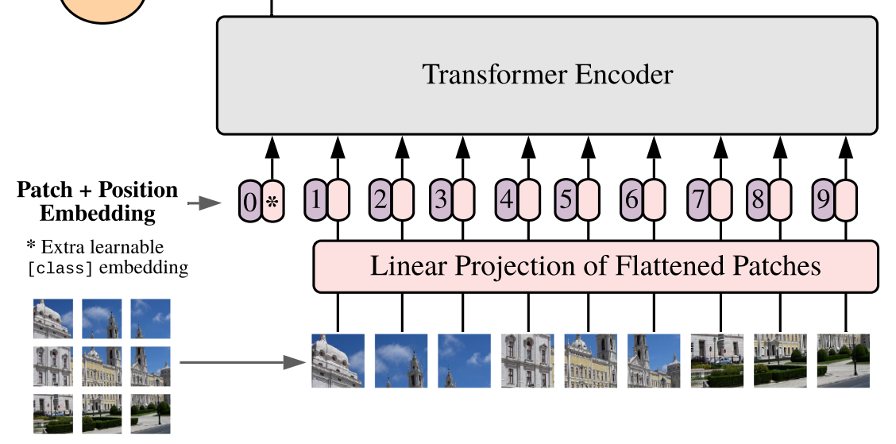

# Replicating Vision Transformers

## Introduction

The introduction of the transformer architecture by [**Vaswani et. al.**](https://doi.org/10.48550/arXiv.1706.) had the most significant impact on the field of artificial intelligence over the last decade. The architecture was so robust that only minimal changes have been proposed since 2017, with the most notable modification being the rearrangement of the layer normalization block. Having a pair of encoder-decoder while completely relying on attention to learn the patterns in the given sequence has proven to be effective enough to introduce the architecture for almost every use case in deep learning.

This project will focus on replicating the model proposed by [**Dosovitskiy et. al.**](https://doi.org/10.48550/arXiv.2010.11929), known as the Vision-Transformer (ViT). This paper introduces the transformer architecture (part of it) to the field of computer vision and image classification tasks. We will disect the parts of the ViT and implement it using PyTorch step-by-step.

**Note: All the hyperparameter numbers described in the examples below are directly extracted from the research paper. The numbers relate to the simplest ViT model.**

## Encoder Input Preperations

We start by processing the image data which is fed to the transformer encoder. We will look at the encoder in a later part of this project. First, we will focus on converting our image data into the below shown format before feeding it to the transformer encoder.

- Overview (just to read through, detailed explanation is below):
    - Each image is chopped into multiple pieces (patches).
    - Data in these patches is converted to patch embeddings.
    - The patch embeddings are grouped with positional embeddings.
    - An extra learnable embedding is added which represents the class of our image (same as \<classification> token in BERT).
    - Learnable embedding is the layer which will contain the useful information when we use the model for inference. The learnt information from the encoder will be stored here. But during training, the information to learn will be stored here (the class label).

 Looking at the input of the transformer encoder 

---

### Patches

- Chop the image into `n` number of patches. This will be `num_patches`.

- The height and width of each patch will be `p`. This will be `patch_size`.

- Example:
    - An image of size `224 x 224` with `3` color channels will be of size `(3, 224, 224)`.

    - Each patch is of size `(16, 16)`. So, `patch_size = (16, 16)`. The number of chops along the height is `224 / 16 = 14`, and similarly, along the width, it is also `224 / 16 = 14`.

    - Having 14 pieces along height and 14 pieces along width makes the `num_patches = 14 * 14 = 196`.

    - We have `196` pieces of data for our encoder. Each patch of the image is treated sperately while feeding it to the encoder. 

---

### Patches to Embeddings

- We have `num_patches` number of patches. Each patch is a piece of an image.

- These patches will have the size of a fixed size. This will be flattened and embedded into `d` number of dimensions. This will be `embed_dims`.

- Each patch is treated serperately. The dependencies and patterns across all the patches is learnt by the multi-head self attention layer in the encoder block (will be discussed later). 

- Example:
    - Each patch is of the size `16 x 16`.

    - This data will be projected (embedded) into `embed_dims` number of dimensions. Let us take `embed_dims = 768`.

    - Each patch will be turned to a linear vector which has the size of `768`.

#### Hybrid architecture

> As an alternative to raw image patches, the input sequence can be formed from feature maps of a CNN (LeCun et al., 1989). In this hybrid model, the patch embedding projection `E` (Eq. 1) is applied to patches extracted from a CNN feature map.

The above given text is from the research paper. It suggests that rather than flattening and embedding the patches, we can also apply an alternative approach. This is introducing CNN to extract feature maps from these images and then flattening these feature maps which will represent the linearly embedded data for each patch. This will be the aprroach for this project.

**CNN for embedding**:
- Using CNN with `kernel_size` of `16 x 16` which is the same as `patch_size`.

- Using stride value of `16 x 16` which is the same as `patch_size`.

- Using these two values will convert an image of size `(3, 224, 224)` into `(d, 14, 14)` as each patch will be converted to one single value from our CNN. Here, `d` is the `output_channels` of our CNN layer. This will be `embed_dims = 768` as it represents the number of dimensions that each patch has to be embedded into.

---